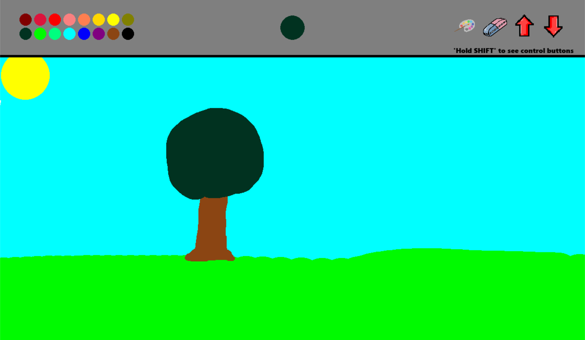
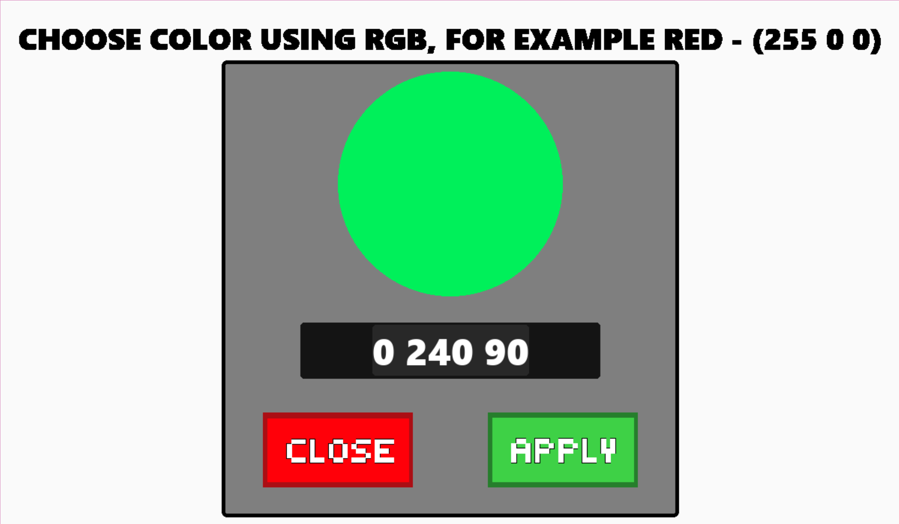

# Pygame Painter App

🖌️ This is a simple painter application built using Pygame, a popular Python library for creating 2D games and graphical applications.




___
## Requirements 🏇

- Pygame

## Installation 💿

1. Clone this repository:

    ```
    git clone https://github.com/k1erro/pypaint.git
    ```

2. Install the required dependencies:

    ```
    pip install -r requirements.txt
    ```
___
